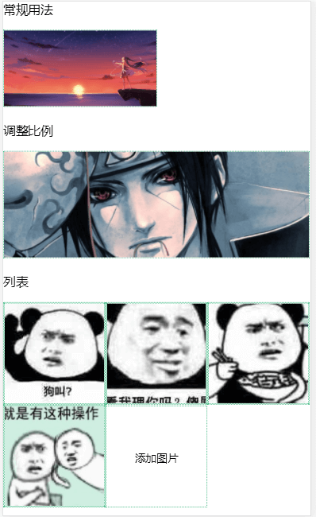
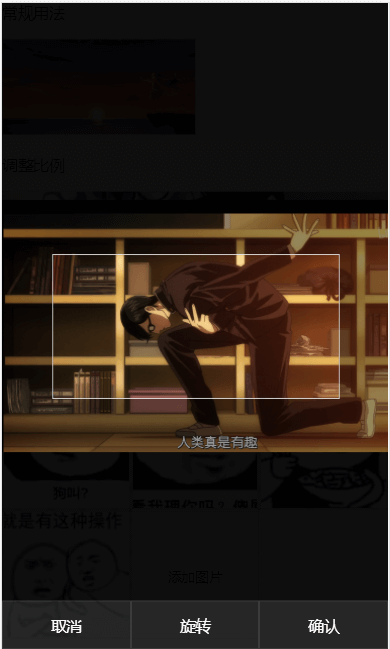

# vue-image-crop
基于Vue的移动端图片裁剪组件
> 组件使用`URL.createObjectURL()`等新特性，使用前注意兼容问题。IE >= 10

## 功能预览


## 快速开始
安装Node >= `8.9.0`（推荐LTS = `8.11.0`）
```
# 安装 vue-cli 3.x
npm install -g @vue/cli

cd vue-image-crop
npm install
npm run dev
```
启动开发模式即可定制功能

## 构建
```
npm run build
```
build之后会重新生成lib文件夹

## API
### props
| 属性名 | 类型 | 默认值 | 说明 |
| -- | -- | -- | -- |
| value | Object | {} |裁剪后的图片对象；必传；可使用v-model绑定|
| proportion | Object | { w: 2, h: 1 } |图片宽高比例对象；非必传；用于动态计算宽高比例，所以w和h两个属性没有固定值|
| quality | Number | 0.92 |清晰度；非必传；[HTMLCanvasElement.toDataURL()](https://developer.mozilla.org/zh-CN/docs/Web/API/HTMLCanvasElement/toDataURL)的第二个参数|
| hasRemove | Boolean | false |是否显示移除按钮；非必传；列表中使用时可能会用到|
| immediatelyUpload | Boolean | false |是否直接上传；非必传；设置为true的时候图片将不会裁剪直接返回|
| config | Object | { size: 1200, isSlice: true, path: null } |配置对象；此对象不传有默认值，若传时对象里的每个属性都必须传；size:图片最大宽度（px），isSlice:是否需要裁剪，path:显示图片时的路径，path参数将直接与图片id拼接(path + id)|

### events
| 事件名 | 说明 | 回调参数 |
| -- | -- | -- |
| remove | 移除按钮被点击时触发 | - |
| change | 改变选中图片时触发 | event.target.files[0]，新文件 |
| submit | 图片操作完成时触发 | 当前裁剪后的图片对象 |
| cancel | 图片操作取消时触发 | - |

## 示例代码
```
<template>
    <div class="ctnr">
        <p>常规用法</p>
        <m-image-crop class="mic mic1"
                      v-model="img"></m-image-crop>

        <p>调整比例</p>
        <m-image-crop class="mic mic2"
                      v-model="img2"
                      :proportion="{ w: 100, h: 35 }"></m-image-crop>

        <p>列表</p>
        <div class="list">
            <div class="item"
                 v-for="(item, index) in imgList"
                 :key="item.id">
                <m-image-crop class="mic"
                              has-remove
                              :value="item"
                              :proportion="{ w: 1, h: 1 }"
                              @remove="removeHandle(index)"></m-image-crop>
            </div>
            <div class="item add"
                 @click="addHandle">添加图片</div>
        </div>

    </div>
</template>

<script>
export default {
    data() {
        return {
            img: {},
            img2: {},
            imgList: []
        };
    },
    methods: {
        addHandle() {
            this.imgList.push({});
        },
        removeHandle(index) {
            this.imgList.splice(index, 1);
        }
    }
};
</script>

<style lang="less">
html,
body {
    margin: 0;
}
.ctnr {
    height: 100vh;
    .mic {
        border: 1px dotted #4fc08d;
    }
    .mic1 {
        width: 200px;
        height: 100px;
    }
    .mic2 {
        width: 100vw;
        height: 35vw;
    }
    .list {
        font-size: 0;
        .item {
            box-sizing: border-box;
            font-size: 14px;
            vertical-align: middle;
            display: inline-block;
            border: 1px dotted #4fc08d;
            width: 33.33vw;
            height: 33.33vw;
        }
        .add {
            text-align: center;
            line-height: 33.33vw;
        }
    }
}
</style>
```